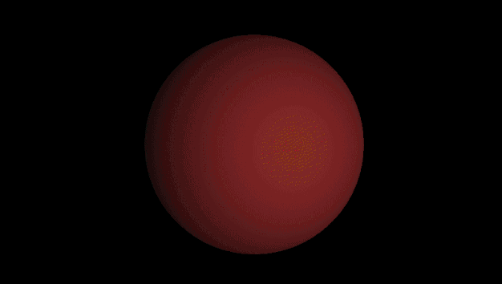

## ray-tracing-screensaver ##

A little project to learn a bit about modern OpenGL and raytracing. There are two versions, one with a single sphere and another with 3 spheres that change location.

### Libraries ###
- [glad](https://github.com/Dav1dde/glad) - to get the latest and greatest in OpenGL
- [glfw](https://github.com/glfw/glfw) - for window context creation
- [glm](https://github.com/g-truc/glm) - for some sweet GLSL maths

### Build ###
To build, run in Windows or *nix
```shell
mkdir build
cd build
cmake ../
```
From there, run either `make` or open Visual Studios to compile.

### Single Sphere ###

