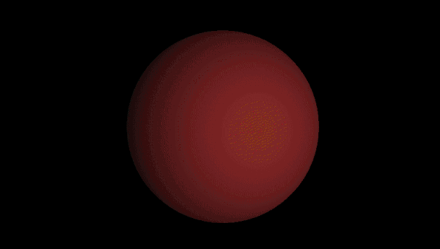

## ray-tracing-screensaver ##

A little project to learn a bit about modern OpenGL and raytracing. There are two versions, one with a single sphere and another with 3 spheres that change location.

### Single Sphere ###

That kind of neat banding is an artifact of the gif.
